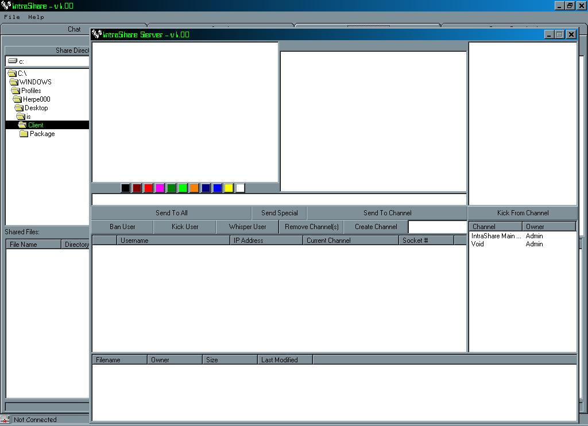



## IntraShare \- Fixed

### Description

This code is like Napster, but lets you transfer any file type, and has a nice search output. This uses the Catalyst SocketWrench Control, which you can get from www.catalyst.com. All this version is is the first, but with some minor bug fixes, and it is actually on PSC now and not on my slow server. It still has the bug with the server freezing if you change to an existing channel on the client, so if you know how to fix that plz help. Just to let you know, i wrote this about a year ago as my first program using sockets, so don't expect many comments.
 
### More Info
 

             |
---                |---
**Submitted On**   |2001-01-01 19:19:32
**By**             |[Cory J\. Geesaman](https://github.com/Planet-Source-Code/PSCIndex/blob/master/ByAuthor/cory-j-geesaman.md)
**Level**          |Intermediate
**User Rating**    |3.5 (14 globes from 4 users)
**Compatibility**  |VB 5\.0, VB 6\.0
**Category**       |[Complete Applications](https://github.com/Planet-Source-Code/PSCIndex/blob/master/ByCategory/complete-applications__1-27.md)
**World**          |[Visual Basic](https://github.com/Planet-Source-Code/PSCIndex/blob/master/ByWorld/visual-basic.md)
**Archive File**   |[CODE\_UPLOAD14528242001\.zip](https://github.com/Planet-Source-Code/cory-j-geesaman-intrashare-fixed__1-15011/archive/master.zip)

